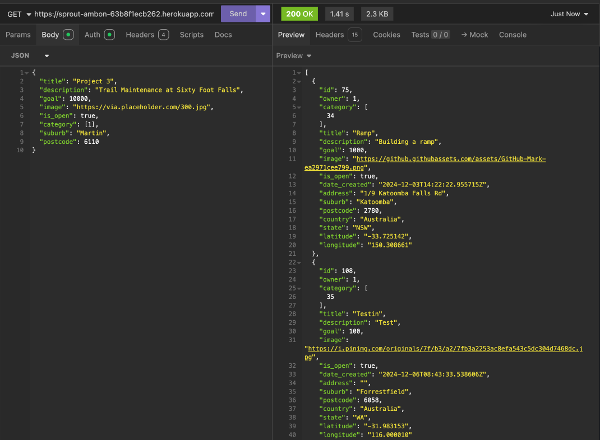
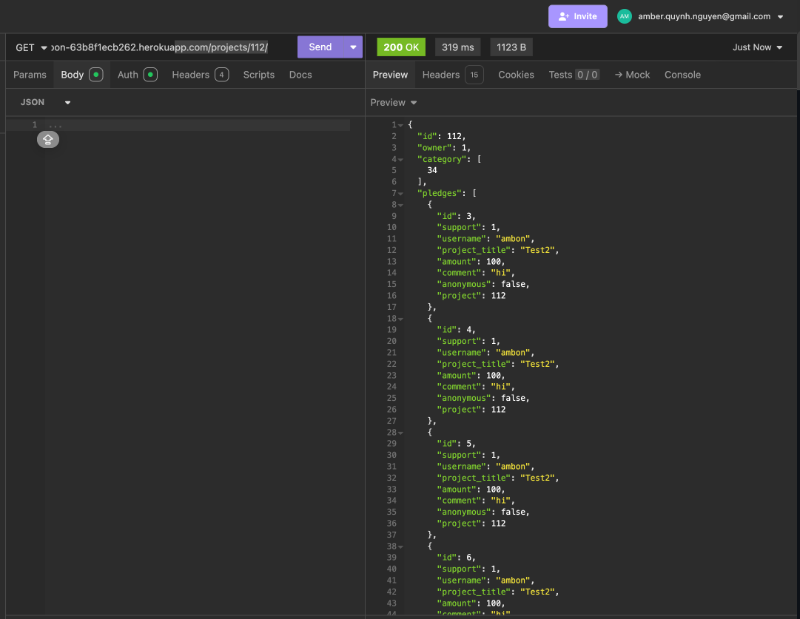

# Crowdfunding Back End - Welcome to Sprout

Sprout is a full-stack crowdfunding platform built with a Python/Django backend and a JavaScript/React frontend.

## Features:

Within this application, users can:

- Sign up and log in.
- Create, update, and delete their own campaigns.
- Make pledges to existing projects.
- View all existing projects.

## Key Details:

- The project model integrates with the Google Maps API to retrieve longitude and latitude coordinates when users enter an address for their fundraising campaign.
- Suitable user permissions are implemented to ensure actions performed within the application are secure and appropriately restricted.

## Planning:

### Concept/Name

Sprout is a community-focused crowdfunding platform dedicated to supporting conservation and outdoor recreation projects. Whether developing new parks, restoring rivers and wildlife habitats, or creating outdoor spaces that inspire future generations, Sprout empowers communities and public land managers to bring their visions to life. By connecting passionate individuals with meaningful environmental projects, we help ensure a greener, more accessible outdoors for everyone.

### Intended Audience/User Stories

Sprout is intended for people who share a vested interest in preserving natural spaces and enhancing outdoor recreation for current and future generations. Sprout can be used as a platform to raise donation towards charities of interest or launch crowdfunding campaigns for local conservation and outdoor projects.

### Front End Pages/Functionality

- {{ A page on the front end }}
  - {{ A list of dot-points showing functionality is available on this page }}
  - {{ etc }}
  - {{ etc }}
- {{ A second page available on the front end }}
  - {{ Another list of dot-points showing functionality }}
  - {{ etc }}

### API Spec

| URL                    | HTTP Method | Purpose                                                              | Request Body                                                                                                                                                                                                                                                              | Successful Response Code | Authentication/Authorisation                                           |
| ---------------------- | ----------- | -------------------------------------------------------------------- | ------------------------------------------------------------------------------------------------------------------------------------------------------------------------------------------------------------------------------------------------------------------------- | ------------------------ | ---------------------------------------------------------------------- |
| /projects/             | GET         | Get a list of all projects to view                                   | N/A                                                                                                                                                                                                                                                                       | 200                      | None -view only                                                        |
| /projects/pk/          | GET         | Get the details of one project with associated pledges and  category | N/A                                                                                                                                                                                                                                                                       | 200                      | None                                                                   |
| /projects/             | POST        | Create a project                                                     | { "title": "Test project4", "description": "testing", "goal": 1, "image": "  [https://tse4.mm.bing.net/th?id=OIP.dm4JwdZmorEWeATp2nlSCgAAAA&pid=Api](https://tse4.mm.bing.net/th?id=OIP.dm4JwdZmorEWeATp2nlSCgAAAA&pid=Api)", "is_open": "True" } | 201                      | a user - needs to have login details and is logged in                  |
| /projects/pk/          | PUT         | Update project details (owner field cannot be updated)               | { "title": "CHANGE THIS", "is_open": "False" }                                                                                                                                                                                                                   | 200                      | A logged-in user who is the project creator                            |
| /projects/pk/          | DELETE      | Delete a project                                                     | N/A                                                                                                                                                                                                                                                                       | 204                      | A logged-in user who is the project creator                            |
| /category/pk/          | GET         | A list of project belonging to a Category                            | N/A                                                                                                                                                                                                                                                                       | 200                      | None                                                                   |
| /category/pk/          | PUT         | Update the category                                                  | N/A                                                                                                                                                                                                                                                                       | 201                      | ADMIN                                                                  |
| /category/pk/          | DELETE      | Delete a Category                                                    | N/A                                                                                                                                                                                                                                                                       | 204                      | ADMIN                                                                  |
| /pledges/              | GET         | Get a list of all the pledges                                        | N/A                                                                                                                                                                                                                                                                       | 200                      | Admin (Superuser)                                                      |
| /pledges/pk/           | GET         | Get the details of one pledge                                        | N/A                                                                                                                                                                                                                                                                       | 200                      | Admin/owner of the pledge                                              |
| /projects/pk/          | GET         | Get all the pledges associated with one project                      | N/A                                                                                                                                                                                                                                                                       | 200                      | None                                                                   |
| /pledges/              | POST        | Make a pledge                                                        | { "amount": 50, "comment": "Love this project!", "anonymous": false, "project": 1 }                                                                                                                                                                        | 201                      | A logged-in user                                                       |
| /pledges/pk/           | PUT         | Update a pledge                                                      | { "amount": 500, "comment": "Updating", "anonymous": false, }                                                                                                                                                                                                 | 201                      | A logged-in user who created the pledge (Admin Should not have access) |
| /pledge/pk/            | DEL         | Delete a pledge                                                      | N/A                                                                                                                                                                                                                                                                       | 200                      | Admin                                                                  |
| /users/                | GET         | Get a list of all existing users                                     | N/A                                                                                                                                                                                                                                                                       | 200                      | Admin                                                                  |
| /users/api-auth-token/ | POST        | User log in                                                          | { ”username”:”user”, ”password”:”password”, }                                                                                                                                                                                                                    | 200                      | A user who has log in details                                          |
| /users/                | POST        | Create a user                                                        | { ”username”:”user”, ”email”:”email@mail.com”, ”password”:”password”, }                                                                                                                                                                                       | 201                      | None                                                                   |
| /users/pk/             | PUT         | Update user detail                                                   | { ”email”:”email1@mail.com”, }                                                                                                                                                                                                                                      | 200                      | Admin/account owner                                                    |
| /users/pk/             | DELETE      | Delete a user                                                        |                                                                                                                                                                                                                                                                           | 204                      | Admin                                                                  |

### DB Schema

### GET a list of all available projects

### POST method for making a pledge

A screenshot of Insomnia, demonstrating a successful POST method for a pledge endpoint 

Confirming new pledge show up by looking at the ProjectDetail endpoint 

### Token

A screenshot of Insomnia, demonstrating a token being returned.

### Step-by-step instruction to register a new user and create a new project

1. Create a new user by entering the username, email and password fields in json format via POST method to /users/ endpoint 
2. Log in as a user via POST request to /api-token-auth/ endpoint to retrieve a token 
3. Copy the token from step 2 into the Auth tab in Insomnia 
4. Make a POST request to /projects/ endpoint with the required fields i.e. "title","goal","image","is_open" and "category" filled out 

### README requirements

- [x] A link to the deployed project. - https://sprout-ambon-63b8f1ecb262.herokuapp.com
- [x] A screenshot of Insomnia, demonstrating a successful GET method for any endpoint.
- [x] A screenshot of Insomnia, demonstrating a successful POST method for any endpoint.
- [x] A screenshot of Insomnia, demonstrating a token being returned.
- [x] Step by step instructions for how to register a new user and create a new project (i.e. endpoints and body data).
- [x] Your refined API specification and Database Schema.
